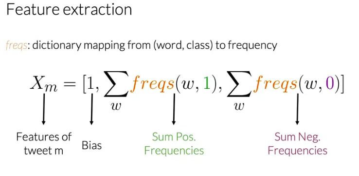

>==OFFLINE CORPUS==
I am happy because I am learning NLP.
I am happy
I am sad because I am not learning NLP.
I am sad
---
>==POSITIVE CLASS **PC**==
I am happy because I am learning NLP.
I am happy
---
>==NEGATIVE CLASS **NC**==
I am sad, I am not learning NLP.
I am sad
---
>==CORPUS VOCABULARY **CV** and the Frequencies==
```python
CV =  [I, am, happy, because, learning, NLP, sad, not]
CPF = PosFreq(1) = [3, 3, 2, 1, 1, 1, 0, 0]
CNF = NegFreq(0) = [3, 3, 0, 0, 1, 1, 2, 1]
Representing as vectors it shows up like this -
PosFreq(1) = [('I',3),('am',3),('happy',2),('because',1), ('learning',1), ('NLP',1),('sad',0),('not',0)]
NegFreq(0) = [('I',3),('am',3),('happy',0),('because',0), ('learning',1), ('NLP',1),('sad',1),('not',1)]
```
1. Have a `corpus` - This is the array of all the tweets
2. Have a `corpus positive class CPC` - This is a set of words with positive sentiments
3. Have a `corpus negative class CNC` - This is a set of words with negative setntiments
4. Create a vocabulary out of this corpus. [vocabular CV]
5. Identify the positive and negative frequencies for each `word` in the vocabulary. These are `corpus frequencies` which will be used to add `weight` to each word in the new tweet.
    - Positive_frequence `CPF(V,PC)` of a `word` in the vocabulary  = Number of times the word is present in the positive class PC
    - Negative_frequence `CNF(V,NC)` of a `word` in the vocabulary  = Number of times the word is present in the negative class NC
---
>==CONVERT A TWEET INTO 3 NUMBERS - 1, POSITIVE FREQUENCY, NEGATIVE FREQUENCY from the corpus==
4. Get a tweet (m)
5. Find the vocabulary of the tweet.
6. Identify the frequencies of each of these words from the corpus frequencies. Note that the semantic is ignored. It is just the words and their weights from the corpus. We dont care anything else here.
5. Find the Positive frequency freqs(w,1) and Negative frequency for the tweet.
```python
1. Say a tweet = "I am sad, I am not learning NLP"
2. Vocabulary V = [I, am, sad, not, learning, NLP]
3. Now convert each word in the vocabulary into numbers based on their weights
   in the CPF and CNF. More they are repeated in a given corpus class, Note that we do not compute the actual frequencies of words in the tweet. Rather we just map them to the frequencies of each words found in the corpus in their respective classes.
   the words in the tweet. Rather we just map each word to their respective
   frequencies in the corpus!
   - sum(PosFreq(1)) = sum([3, 3, 0, 0, 1, 1]) = 8
   - sum(NegFreq(0)) = [3, 3, 2, 1, 1, 1] = 11
```
8. $X_m$ = [1,8,11]

